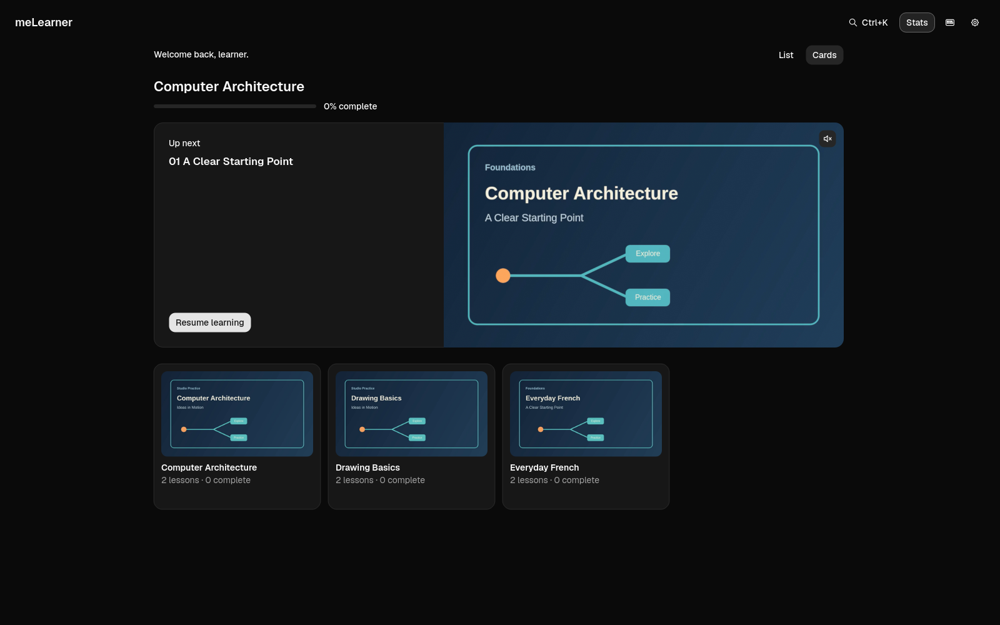
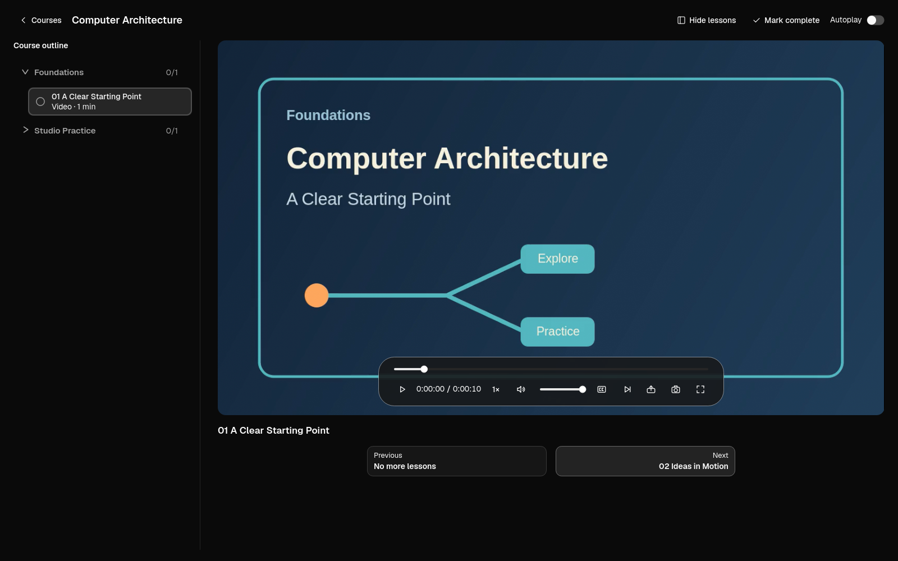

# meLearner

Organise, watch and complete your downloaded courses from one place without having to manually figure out what to watch next. Browse videos, audio and readings, then pick up where you left off.

Screenshots show sample courses.

## Downloads

| Platform | Download |
| --- | --- |
| Linux | [AppImage](https://github.com/WhiteHades/melearner/releases/download/v0.1.9/melearner_0.1.9_amd64.AppImage) |
| Linux (Arch) | [Package](https://github.com/WhiteHades/melearner/releases/download/v0.1.9/melearner-bin-0.1.9-1-x86_64.pkg.tar.zst) |
| Windows | [Setup installer](https://github.com/WhiteHades/melearner/releases/download/v0.1.9/melearner-0.1.9-setup.exe) |
| macOS | [Disk image](https://github.com/WhiteHades/melearner/releases/download/v0.1.9/melearner-0.1.9-macos-arm64.dmg) |

## Get started

1. Open meLearner.
2. Choose your course folder.
3. Pick a lesson.

For technical details and more ways to install, see [Advanced setup](docs/advanced.md).

[Install](docs/install.md) · [Help](docs/usage.md) · [Contribute](CONTRIBUTING.md) · [License](LICENSE)
